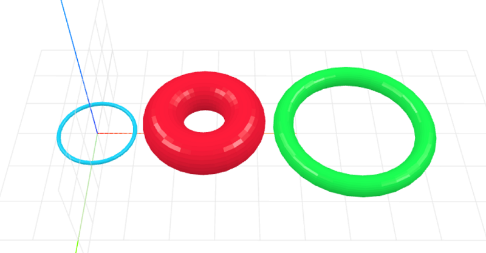

# craft-ring
Parameterized Ring Model

### Usage
```html
<craft>
    <craft name="ring" module="craft-ring"/>
    <ring></ring>
</craft>
```

### Parameters
- radius: adjusts radius of ring
    - default: 20
- thickness: adjusts thickness of ring
    - default: 5

### Example
```html
<craft>
    <craft name="ring" module="craft-ring"/>
    <row spacing="2" t="land()">
        <ring radius="10" thickness="1"></ring>
        <ring radius="15" thickness="10"></ring> 
        <ring></ring>
    </row>
</craft>
```

